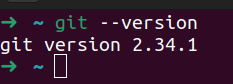
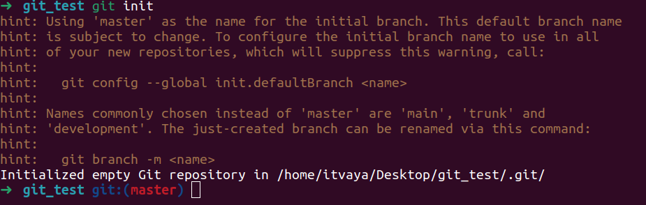
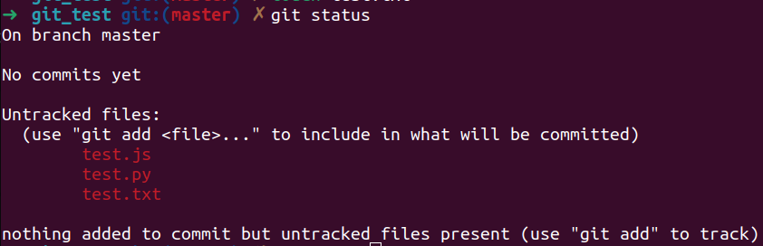
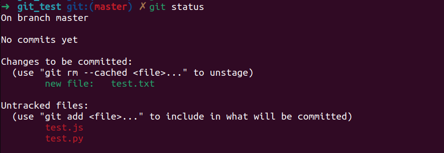
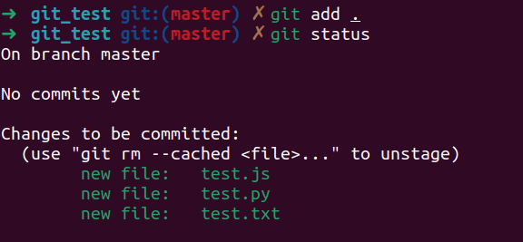
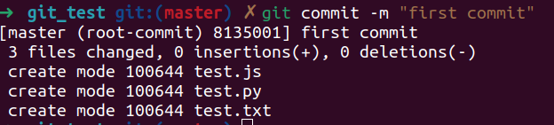
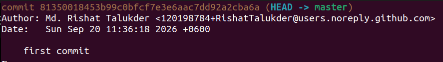
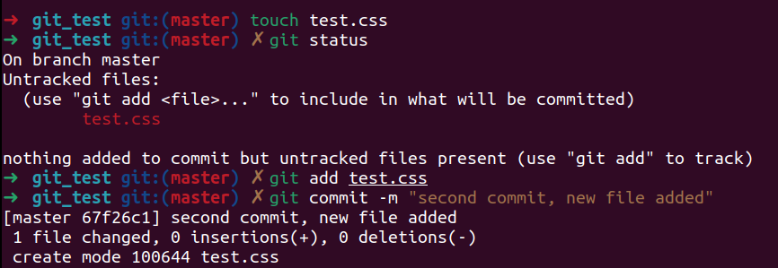
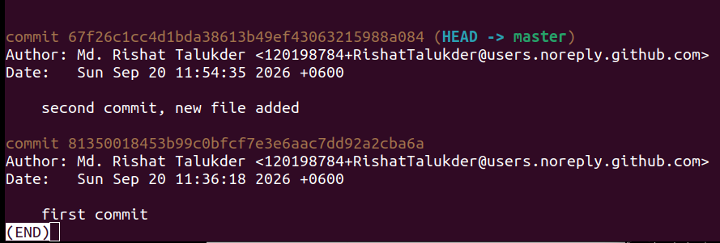
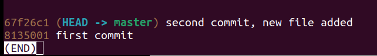

# Git_and_Github

A repository of the Learning Git & Github in youtube

This repository contains dummy files and directories for practicing git and github

## Installation

On windows you can install git fromt their [official website.](https://git-scm.com/)

If you are in linux git should already be installed in your system. And if not than you can also install the linux version of git from the same website.

Only thing you need is to open your terminal and type:

```bash
git --version
```

if you see something like this:


You are all good to go.

# What is Git and Github?

Git is a distributed version control system. Emphasis on the distributed.

Github is a platform for hosting `git repositories`.

Too many fancy lingo going on. Let me elaborate.

Git is a tracking too. Not like a GPS but more like text change tracker.

Let's say you are making a tik-tac-toe game with some of your friends. 

The game will have multiple files, and it won't be a very smart decision to work on the game in a single PC.

So, you and your three friends decide to code from your own laptops at home. This is where Git comes in.

Since Git is distributed, each one of you gets an exact, identical copy of the entire game folder on your own computer. You don't need the internet to work. If you are writing the code to check who wins the game, Git sits on your laptop and tracks every line of text you change. If you make a mistake and break the code, Git lets you roll back to a version from an hour ago when it still worked.

But right now, your laptop only knows about your changes. It has no idea what your friends are doing on their laptops.

That is why you need GitHub.

GitHub is the central cloud server where you create a main folder (a repository) for your tic-tac-toe game. When you finish the winning logic on your laptop, you send your tracked changes up to GitHub. When your friend finishes building the game grid on their laptop, they send their changes up to GitHub too.

GitHub acts like the ultimate referee. Instead of you guys emailing files back and forth and accidentally deleting each other's code, GitHub takes everyone's separate updates and seamlessly stitches them together into one finished, working game.

So, you have a very simple way of maintaining your code and working together with a team on a single project.

# Setting up a Git Repository

> A git repository is a collection of files and directories that are `tracked` by git.

If you've installed git properly than make a new folder named `anything you want`.

Inside that folder, make 2 or three empty files.

I made a file named `test.txt`, `test.js` and `test.py`.

Let's just assume this folder is your project folder. Now, open this folder in your terminal.

Git is mainly a command line tool. So, you have to use the terminal and navigate to your project folder first.

> Git has it's own GUI for easy navigation and management. If you use VS code for your work than it also has a built in git manager in the sidebar named version control.

## Git Init

Now, in the terminal type:

```bash
git init
```

After running this command you should see something like this:



You might get overwhelmed but the last line is the most important one.

`Initialized empty Git repository in /home/username/Desktop/git_test/.git/`

This line is git telling you, 'Bro this folder is mine now. I see everything here.'

> After you use this command you shaould take a look inside your folder. You'll see a new folder named `.git` inside your project folder. This folder contains all information about your `git repository`. Any time you make a git repo or clone a git repo you'll see this folder. Any folder containing `.git` will by default be considered as a git repository by your computer.

## Git Status

Now, you might want to know what git is actually seeing.

```bash
git status
```

After running this command you will see some usefull information.



First line is `On branch master`. This tell you the name of the branch you are currently working on.

> Branches are like separate snapshots of your project. Each branch can be completely separated from each other. a branch acts as an independent timeline or snapshot of your project's history, allowing you to work on new features or bug fixes without affecting the main codebase. I will talk more about branches later.

The next line says, `no commits yet`, meaning you haven't made any saves to the repository yet.

> A commit the act of saving `changes` to the repository. It's like saying yes Im happy with the work and I want to save it. This also let's you come back to this exact commit later if you need to. So, a commit works as a checkpoint and a snapshot of your project.

The last line tells you `nothing to commit (create/copy files and use "git add" to track)`. Meaning even though you's repository is initialized and is being tracked git doesn't have any files to monitor. You should use git add command to add the files you want to track.

# Git Architecture

The Git architecture mainly has four areas:

- The working directory.
- The staging area.
- The local repository.
- The remote repository.

The `working directory` referes to the folder you are currently working in. It's where you write your code and files.

The `staging area` is for storing the changes you made to the files in your working directory before committing them to the repository.

The `local repository` is a collection of files and directories that are tracked by git. It's where you store your project and its history.

The `remote repository` is a cloud platform where you can `push` your local repository to. That's where you share your project with others.

Your code will live in these four areas.

# Git config

For your identification purposes you need to set your name and email.

```bash
git config --global user.name "Your Name"
git config --global user.email "Your Email"
```

You have to do this because git expects the indentity of the person who is making the commits. It's like a signature.

# Git Add

Git add is the command to add files to the staging area from your working directory.

```bash
git add test.txt
```

Now, git will actively track the changes you made to the file.

You can check by typing git status again.



As you can see only the `test.txt` file is now being tracked. Other file are still being ignored.

You can also stage every untracked file all at once.

```bash
git add .
```



# Git Commit

Commit is the process of taking the staged changes and saving them to the `local repository`.

> Remember, git commmit will only save the changes you made to the files in the staging area.

Anything outside the staging area will be ignored.

All the files of the folder is now staging area. Let save it in the repository.

```bash
git commit -m "first commit"
```

> When you are commiting something you must add a commit messege to explain what you did. You have to use the `-m` flag to do that.

After pressing enter you should see something like this.



You can see which files you've saved and the commit messege you used.

Now, remember when I said a commit is a checkpoint and a snapshot of your project at the time you made the commit.

## Git Log

You can check all the commits by typing:

```bash
git log
```



You can see all the commits done in a branch by `git log`.

I'll make a new file named `test.css` and commit it just to show you how usefull git log is.



```bash
git log
```



> If you having trouble getting out of this screen just press `q`.

So much information about is being stored in the logs. But here's a problem when you have a lot of commits you don't really need this much information all the time.

You use can use `git log --oneline` to get a short summary of the commits.



Only the commit messeges are shown.

# Using git with vscode

If you use vs code as your default work environment, vscode comes built in with a nice version control manager in the sidebar.

You can press `ctrl+g` or `ctrl+shift+g` to open the version control manager.

It only works if your pc has a git already installed. Vscode should automatically detect if you have git installed properly in your system.

Almost everything works the same. You can see the files that are being tracked, stage files, commit files and almost every feature is there with nice GUI like buttons.

I use it a lot because I can see everything in single palce and I dont have remember a lot of git commands.

